# Fase 2 — Arquitectura de información

Generado por `scripts/arquitectura/mapa-urls.mjs`. Fuente de verdad del menú, las migas de pan y el mapa web: `src/data/arquitectura.json`.

## Principios

1. **Todo tiene sitio.** Las 163 páginas actuales tienen una URL nueva; el script falla si alguna queda fuera.
2. **URLs limpias en español**, sin `.php` y sin tildes: `/agua-en-gran-canaria/presas/volumenes/`.
3. **Nueve secciones** con URL propia (las del prompt). En la cabecera se agrupan en **7 entradas de mega-menú** para que quepan en 1280 px: *Mapas y cartografía* va dentro de «El agua» y *Fondos europeos* dentro de «Transparencia».
4. **Rutas por tipo de visitante** (propuesta de Victoria Crea): la portada ofrece accesos para Ciudadanía, Regantes y agricultura, Empresas, y Administración y prensa.
5. **Barra de utilidades** en todas las páginas: Sede electrónica · Perfil del contratante · Transparencia · Empleo · Buscador · Redes sociales.
6. **Pie:** dirección, teléfono, horario de registro, enlaces legales (Aviso legal, Privacidad, Accesibilidad, Enlaces, Ubicación, Mapa web), logotipos institucionales y redes sociales.

## Menú principal

- **El Consejo** → El Consejo
- **El agua** → Agua en Gran Canaria + Mapas y cartografía
- **Planificación** → Planificación
- **Servicios y trámites** → Servicios y trámites
- **Transparencia** → Transparencia + Fondos europeos y subvenciones
- **Divulgación** → Divulgación
- **Actualidad** → Actualidad

## Accesos por perfil (portada)

- **Ciudadanía** — Divulgación, datos del agua y consejos prácticos. Estado de los embalses · Consejos de ahorro · Noticias · Avisos y alertas · Divulgación · Pluviómetros
- **Regantes y agricultura** — Normativa, concesiones, impresos y trámites. Registro y descarga de documentos · Tarifas, cánones y precios públicos · Tasas · Normativa · Anuncios · Elecciones de Consejeros
- **Empresas** — Contratación pública, facturación y licitaciones. Contratación · Perfil del contratante · Facturación electrónica · Normativa · Sede electrónica
- **Administración y prensa** — Transparencia, planificación, informes y cartografía. Transparencia · Plan Hidrológico · Plan de Gestión del Riesgo de Inundación · Mapas y cartografía · Juntas y sesiones · Noticias

## Mapa del sitio

- **Inicio** `/` ← `/`
- **El Consejo** `/el-consejo/` ← `/el_consejo.php`
  - **Introducción** `/el-consejo/introduccion/` ← `/el_consejo/introduccion.php`
  - **Funciones** `/el-consejo/funciones/` ← `/el_consejo/funciones.php`
  - **Organización** `/el-consejo/organizacion/` ← `/el_consejo/organizacion.php`
  - **Órganos de Gobierno** `/el-consejo/organos-de-gobierno/` ← `/el_consejo/organos_gobierno.php`
  - **Juntas y sesiones** `/el-consejo/juntas-y-sesiones/` ← `/el_consejo/juntas.php`
  - **Elecciones de Consejeros** `/el-consejo/elecciones-de-consejeros/` ← `/elecciones.php`
  - **Ubicación y contacto** `/el-consejo/ubicacion-y-contacto/` ← `/el_consejo/ubicacion.php`
- **Agua en Gran Canaria** `/agua-en-gran-canaria/` · *nueva*
  - **Presas** `/agua-en-gran-canaria/presas/` ← `/presas/ubicacion_presas.php`
    - **Estado de los embalses** `/agua-en-gran-canaria/presas/volumenes/` ← `/presas/volumenes.php`
    - **Archivo técnico** `/agua-en-gran-canaria/presas/archivo-tecnico/` ← `/presas/archivo.php`
  - **Salto de Chira** `/agua-en-gran-canaria/salto-de-chira/` ← `/concurso_hidro.php`
  - **Desaladoras** `/agua-en-gran-canaria/desaladoras/` ← `/agua/desaladoras.php`
  - **Pluviómetros** `/agua-en-gran-canaria/pluviometros/` ← `/pluviometros.php`
  - **Instalaciones hidráulicas subterráneas** `/agua-en-gran-canaria/instalaciones-hidraulicas-subterraneas/` ← `/cartografia/CensoInstalaciones/map-censo.html`
  - **Inventario insular de cauces** `/agua-en-gran-canaria/inventario-insular-de-cauces/` ← `/cartografia/Catalogo_Cauces/index.html`
- **Planificación** `/planificacion/` · *nueva*
  - **Plan Hidrológico** `/planificacion/plan-hidrologico/` ← `/plan_hidro.php`
    - **Art. 47 · Volumen I: Documento de información** `/planificacion/plan-hidrologico/art-47/volumen-1/` ← `/planhidro/art47/volumen1.php`
    - **Art. 47 · Volumen II: Documento de ordenación** `/planificacion/plan-hidrologico/art-47/volumen-2/` ← `/planhidro/art47/volumen2.php`
    - **Art. 47 · Normativa** `/planificacion/plan-hidrologico/art-47/normativa/` ← `/planhidro/art47/normativa.php`
  - **Plan de Gestión del Riesgo de Inundación** `/planificacion/riesgo-de-inundacion/` ← `/inundaciones.php`
  - **Directiva Marco del Agua** `/planificacion/directiva-marco-del-agua/` ← `/planhidro/directiva/marco_agua.php`
    - **Conceptos básicos** `/planificacion/directiva-marco-del-agua/conceptos-basicos/` ← `/planhidro/directiva/conceptos_basicos.php`
    - **Antecedentes de planificación** `/planificacion/directiva-marco-del-agua/antecedentes/` ← `/planhidro/directiva/antecedentes_planificacion.php`
    - **Enlaces externos** `/planificacion/directiva-marco-del-agua/enlaces/` ← `/planhidro/directiva/enlaces_externos.php`
    - *(21 fichas: `/planificacion/directiva-marco-del-agua/documentos/agua-esencial/`, `/planificacion/directiva-marco-del-agua/documentos/calendario-programa-trabajo/`…)*
  - **Red de Control 2009** `/planificacion/red-de-control-2009/` ← `/red_control.php`
  - **Participación pública** `/planificacion/participacion-publica/` · *nueva*
- **Mapas y cartografía** `/mapas-y-cartografia/` ← `/cartografia.php`
  - **Medio físico** `/mapas-y-cartografia/medio-fisico/` ← `/cartografia/medio_fisico.php`
    - **Barrancos y Cuencas** `/mapas-y-cartografia/medio-fisico/barrancos-y-cuencas/` ← `/cartografia/medio_fisico/barrancos_cuencas.php`
    - **Cultivos** `/mapas-y-cartografia/medio-fisico/cultivos/` ← `/cartografia/medio_fisico/cultivos.php`
    - **Permeabilidad** `/mapas-y-cartografia/medio-fisico/permeabilidad/` ← `/cartografia/medio_fisico/permeabilidad.php`
    - **Relieve** `/mapas-y-cartografia/medio-fisico/relieve/` ← `/cartografia/medio_fisico/relieve.php`
  - **Marco administrativo** `/mapas-y-cartografia/marco-administrativo/` ← `/cartografia/marco.php`
    - **Masas de agua** `/mapas-y-cartografia/marco-administrativo/masas-de-agua/` ← `/cartografia/marco/masas.php`
    - **Zonificación** `/mapas-y-cartografia/marco-administrativo/zonificacion/` ← `/cartografia/marco/zonificacion.php`
  - **Infraestructuras hidráulicas** `/mapas-y-cartografia/infraestructuras-hidraulicas/` ← `/cartografia/infraestructura.php`
    - **Infraestructuras del consejo** `/mapas-y-cartografia/infraestructuras-hidraulicas/infraestructuras-del-consejo/` ← `/cartografia/infraestructura/consejo.php`
    - **Depuradoras y desaladoras** `/mapas-y-cartografia/infraestructuras-hidraulicas/depuradoras-y-desaladoras/` ← `/cartografia/infraestructura/depuradoras.php`
    - **Pozos** `/mapas-y-cartografia/infraestructuras-hidraulicas/pozos/` ← `/cartografia/infraestructura/pozos.php`
    - **Presas** `/mapas-y-cartografia/infraestructuras-hidraulicas/presas/` ← `/cartografia/infraestructura/presas.php`
  - **Gestión del agua** `/mapas-y-cartografia/gestion-del-agua/` ← `/cartografia/gestion.php`
    - **Pluviometria** `/mapas-y-cartografia/gestion-del-agua/pluviometria/` ← `/cartografia/gestion/pluviometria.php`
    - **Redes de Control** `/mapas-y-cartografia/gestion-del-agua/redes-de-control/` ← `/cartografia/gestion/redes.php`
  - **Cartografía temática** `/mapas-y-cartografia/cartografia-tematica/` ← `/cartografia/tematica.php`
    - **Consumos Agrarios** `/mapas-y-cartografia/cartografia-tematica/consumos-agrarios/` ← `/cartografia/tematica/consumos.php`
    - **Precipitaciones** `/mapas-y-cartografia/cartografia-tematica/precipitaciones/` ← `/cartografia/tematica/precipitaciones.php`
- **Servicios y trámites** `/servicios/` · *nueva*
  - **Sede electrónica** `https://consejoinsularaguasgrancanaria.sedelectronica.es` ↗ externo
  - **Registro y descarga de documentos** `/servicios/descarga-de-documentos/` ← `/servicios/documento.php`
  - **Tasas** `/servicios/tasas/` ← `/servicios/tarifa.php`
  - **Tarifas, cánones y precios públicos** `/servicios/tarifas-canones-y-precios-publicos/` ← `/servicios/tarifas.php`
  - **Normativa** `/servicios/normativa/` ← `/servicios/legislacion.php`
    - **Canarias** `/servicios/normativa/canarias/` · *nueva*
      - *(15 fichas: `/servicios/normativa/canarias/auxilio-obras/`, `/servicios/normativa/canarias/buenas-practicas/`…)*
    - **España** `/servicios/normativa/espana/` · *nueva*
      - *(22 fichas: `/servicios/normativa/espana/calidad-aguas/`, `/servicios/normativa/espana/criterios-sanitarios/`…)*
    - **Unión Europea** `/servicios/normativa/union-europea/` · *nueva*
      - *(6 fichas: `/servicios/normativa/union-europea/aguas-residuales/`, `/servicios/normativa/union-europea/directiva-inundaciones/`…)*
  - **Contratación** `/servicios/contratacion/` ← `/perfil_con.php`
    - **Perfil del contratante** `/servicios/contratacion/perfil-del-contratante/` ← `/perfil_con_2.php`
  - **Facturación electrónica** `https://consejoinsularaguasgrancanaria.sedelectronica.es/e-invoice` ↗ externo
  - **Empleo** `https://consejoinsularaguasgrancanaria.sedelectronica.es/board/9753e838-f59b-11de-b600-00237da12c6a/` ↗ externo
  - **Enlaces de interés** `/servicios/enlaces/` ← `/servicios/enlaces.php`
- **Transparencia** `/transparencia/` ← `/transparencia.php`
  - **Institucional** `/transparencia/institucional/` ← `/consejo.php`
  - **Económico-financiera** `/transparencia/economico-financiera/` ← `/economico.php`
  - **Presupuestos** `/transparencia/presupuestos/` ← `/presupuesto.php`
  - **Periodo medio de pago a proveedores** `/transparencia/periodo-medio-de-pago/` ← `/info.php`
  - **Contratos** `/servicios/contratacion/` (acceso directo)
  - **Convenios y encomiendas** `/transparencia/convenios-y-encomiendas/` ← `/convenio.php`
  - **Empleados públicos** `/transparencia/empleados-publicos/` ← `/empleados.php`
  - **Ayudas y subvenciones** `/transparencia/ayudas-y-subvenciones/` ← `/ayudas.php`
  - **Obras públicas** `/transparencia/obras-publicas/` ← `/obras.php`
  - **Patrimonio** `/transparencia/patrimonio/` ← `/patrimonio.php`
  - **Estadística** `/transparencia/estadistica/` ← `/estadistica.php`
  - **Fomento de la transparencia** `/transparencia/fomento-de-la-transparencia/` ← `/fomento.php`
  - **Portal de Transparencia (sede externa)** `https://transparencia.aguasgrancanaria.com/index` ↗ externo
- **Fondos europeos y subvenciones** `/fondos-europeos/` · *nueva*
  - **Fondos FEDER** `/fondos-europeos/feder/` ← `/fondos_feder.php`
  - **Actuaciones FEDER: AQUAMAC y POI Canarias** `/fondos-europeos/feder/actuaciones-aquamac/` ← `/divulgacion/fondos_feder.php`
  - **NextGenerationEU** `/fondos-europeos/nextgenerationeu/` ← `/nextgeneration.php`
  - **Subvenciones al sobrecoste** `/fondos-europeos/subvenciones-al-sobrecoste/` ← `/subvenciones.php`
- **Divulgación** `/divulgacion/` ← `/divulgacion.php`
  - **Consejos de ahorro** `/divulgacion/consejos-de-ahorro/` ← `/consejos_ahorro.php`
  - **Riada en Tasarte** `/divulgacion/riada-en-tasarte/` ← `/divulgacion/riada_tasarte.php`
  - **Jóvenes por el Agua** `/divulgacion/jovenes-por-el-agua/` ← `/divulgacion/jovenes_agua.php`
  - **Jornadas** `/divulgacion/jornadas/` ← `/divulgacion/jornadas.php`
  - **Artículos y publicaciones** `/divulgacion/articulos-y-publicaciones/` ← `/divulgacion/articulos_publicaciones.php`
    - **Estudio hidrogeológico del este de Gran Canaria** `/divulgacion/articulos-y-publicaciones/estudio-hidrogeologico-del-este-de-gran-canaria/` ← `/divulgacion/articulos/estudio_hidrogeologico.php`
    - **Estudio científico de los recursos de agua en las Islas Canarias SPA/69/515** `/divulgacion/articulos-y-publicaciones/estudio-cientifico-recursos-de-agua-islas-canarias/` ← `/divulgacion/articulos/estudio_cientifico.php`
  - **Plan Hidrológico de 1988** `/divulgacion/plan-hidrologico-1988/` · *nueva*
    - **El Medio como Punto de Partida** `/divulgacion/plan-hidrologico-1988/el-medio-como-punto-de-partida/` ← `/divulgacion/punto_partida.php`
    - **El Ciclo hidrológico** `/divulgacion/plan-hidrologico-1988/el-ciclo-hidrologico/` ← `/divulgacion/ciclo_hidrologico.php`
    - **Recursos Superficiales** `/divulgacion/plan-hidrologico-1988/recursos-superficiales/` ← `/divulgacion/recursos_superficiales.php`
      - **Tabla 1.- Grandes presas** `/divulgacion/plan-hidrologico-1988/recursos-superficiales/tabla-1-grandes-presas/` ← `/divulgacion/recu_super/tabla1.php`
      - **Tabla 2.- Obras de almacenamiento en Gran Canaria** `/divulgacion/plan-hidrologico-1988/recursos-superficiales/tabla-2-obras-de-almacenamiento/` ← `/divulgacion/recu_super/tabla2.php`
    - **Recursos Subterráneos** `/divulgacion/plan-hidrologico-1988/recursos-subterraneos/` ← `/divulgacion/recursos_subterraneos.php`
    - **Recursos no naturales** `/divulgacion/plan-hidrologico-1988/recursos-no-naturales/` ← `/divulgacion/recursos_no_naturales.php`
      - **Tabla 1.- Estaciones depuradoras** `/divulgacion/plan-hidrologico-1988/recursos-no-naturales/tabla-1-estaciones-depuradoras/` ← `/divulgacion/recu_no/tabla1.html`
      - **Tabla 2.- Desaladoras de agua de mar** `/divulgacion/plan-hidrologico-1988/recursos-no-naturales/tabla-2-desaladoras-de-agua-de-mar/` ← `/divulgacion/recu_no/tabla2.html`
      - **Tabla 3.- Desaladoras de agua salobre** `/divulgacion/plan-hidrologico-1988/recursos-no-naturales/tabla-3-desaladoras-de-agua-salobre/` ← `/divulgacion/recu_no/tabla3.html`
    - **El Uso del Agua** `/divulgacion/plan-hidrologico-1988/el-uso-del-agua/` ← `/divulgacion/uso_agua.php`
    - **Escenarios Futuros** `/divulgacion/plan-hidrologico-1988/escenarios-futuros/` ← `/divulgacion/escenario.php`
    - **Elección de Opciones** `/divulgacion/plan-hidrologico-1988/eleccion-de-opciones/` ← `/divulgacion/opciones.php`
    - **Principios, Directrices y Prevenciones** `/divulgacion/plan-hidrologico-1988/principios-directrices-y-previsiones/` ← `/divulgacion/principios_directrices.php`
    - **Programa de Actuación** `/divulgacion/plan-hidrologico-1988/programa-de-actuacion/` ← `/divulgacion/programa_acutacion.php`
    - **Ordenanzas** `/divulgacion/plan-hidrologico-1988/las-ordenanzas/` ← `/divulgacion/ordenanzas.php`
- **Actualidad** `/actualidad/` · *nueva*
  - **Noticias** `/actualidad/noticias/` ← `/noticias.php`
  - **Anuncios** `/actualidad/anuncios/` ← `/info_public.php`
  - **Avisos y alertas** `/actualidad/avisos/` · *nueva*
- Utilidades: Sede electrónica · Perfil del contratante · Transparencia · Empleo
- **Aviso legal** `/aviso-legal/` ← `/el_consejo/avisos.php`
- **Privacidad** `/privacidad/` ← `/privacidad.php`
- **Accesibilidad** `/accesibilidad/` ← `/accesibilidad.php`
- **Mapa web** `/mapa-web/` · *nueva*
- **Buscar** `/buscar/` · *nueva*
- **Centro de documentos** `/centro-de-documentos/` · *nueva*

### Vista general

```mermaid
flowchart LR
  H["Inicio"]
  H --> S0["El Consejo"]
  H --> S1["Agua en Gran Canaria"]
  H --> S2["Planificación"]
  H --> S3["Mapas y cartografía"]
  H --> S4["Servicios y trámites"]
  H --> S5["Transparencia"]
  H --> S6["Fondos europeos y subvenciones"]
  H --> S7["Divulgación"]
  H --> S8["Actualidad"]
  S0 --> S0_0["Introducción"]
  S0 --> S0_1["Funciones"]
  S0 --> S0_2["Organización"]
  S0 --> S0_3["Órganos de Gobierno"]
  S0 --> S0_4["Juntas y sesiones"]
  S0 --> S0_5["Elecciones de Consejeros"]
  S0 --> S0_6["Ubicación y contacto"]
  S1 --> S1_0["Presas"]
  S1 --> S1_1["Salto de Chira"]
  S1 --> S1_2["Desaladoras"]
  S1 --> S1_3["Pluviómetros"]
  S1 --> S1_4["Instalaciones hidráulicas subterráneas"]
  S1 --> S1_5["Inventario insular de cauces"]
  S2 --> S2_0["Plan Hidrológico"]
  S2 --> S2_1["Plan de Gestión del Riesgo de Inundación"]
  S2 --> S2_2["Directiva Marco del Agua"]
  S2 --> S2_3["Red de Control 2009"]
  S2 --> S2_4["Participación pública"]
  S3 --> S3_0["Medio físico"]
  S3 --> S3_1["Marco administrativo"]
  S3 --> S3_2["Infraestructuras hidráulicas"]
  S3 --> S3_3["Gestión del agua"]
  S3 --> S3_4["Cartografía temática"]
  S4 --> S4_0["Registro y descarga de documentos"]
  S4 --> S4_1["Tasas"]
  S4 --> S4_2["Tarifas, cánones y precios públicos"]
  S4 --> S4_3["Normativa"]
  S4 --> S4_4["Contratación"]
  S4 --> S4_5["Enlaces de interés"]
  S5 --> S5_0["Institucional"]
  S5 --> S5_1["Económico-financiera"]
  S5 --> S5_2["Presupuestos"]
  S5 --> S5_3["Periodo medio de pago a proveedores"]
  S5 --> S5_4["Contratos"]
  S5 --> S5_5["Convenios y encomiendas"]
  S5 --> S5_6["Empleados públicos"]
  S5 --> S5_7["Ayudas y subvenciones"]
  S6 --> S6_0["Fondos FEDER"]
  S6 --> S6_1["Actuaciones FEDER: AQUAMAC y POI Canarias"]
  S6 --> S6_2["NextGenerationEU"]
  S6 --> S6_3["Subvenciones al sobrecoste"]
  S7 --> S7_0["Consejos de ahorro"]
  S7 --> S7_1["Riada en Tasarte"]
  S7 --> S7_2["Jóvenes por el Agua"]
  S7 --> S7_3["Jornadas"]
  S7 --> S7_4["Artículos y publicaciones"]
  S7 --> S7_5["Plan Hidrológico de 1988"]
  S8 --> S8_0["Noticias"]
  S8 --> S8_1["Anuncios"]
  S8 --> S8_2["Avisos y alertas"]
```

## Páginas nuevas (sin equivalente directo en la web actual)

- `/buscar/` **Buscar** — página índice de sección o herramienta (buscador, centro de documentos, mapa web).
- `/centro-de-documentos/` **Centro de documentos** — página índice de sección o herramienta (buscador, centro de documentos, mapa web).
- `/agua-en-gran-canaria/` **Agua en Gran Canaria** — página índice de sección o herramienta (buscador, centro de documentos, mapa web).
- `/planificacion/` **Planificación** — página índice de sección o herramienta (buscador, centro de documentos, mapa web).
- `/planificacion/participacion-publica/` **Participación pública** — contenido: Noticia destacada de la home actual (modal «Sesiones de Participación activa…»)
- `/servicios/` **Servicios y trámites** — página índice de sección o herramienta (buscador, centro de documentos, mapa web).
- `/servicios/normativa/canarias/` **Canarias** — página índice de sección o herramienta (buscador, centro de documentos, mapa web).
- `/servicios/normativa/espana/` **España** — página índice de sección o herramienta (buscador, centro de documentos, mapa web).
- `/servicios/normativa/union-europea/` **Unión Europea** — página índice de sección o herramienta (buscador, centro de documentos, mapa web).
- `/fondos-europeos/` **Fondos europeos y subvenciones** — página índice de sección o herramienta (buscador, centro de documentos, mapa web).
- `/divulgacion/plan-hidrologico-1988/` **Plan Hidrológico de 1988** — página índice de sección o herramienta (buscador, centro de documentos, mapa web).
- `/actualidad/` **Actualidad** — página índice de sección o herramienta (buscador, centro de documentos, mapa web).
- `/actualidad/avisos/` **Avisos y alertas** — página índice de sección o herramienta (buscador, centro de documentos, mapa web).
- `/mapa-web/` **Mapa web** — página índice de sección o herramienta (buscador, centro de documentos, mapa web).

Sus textos de introducción son microcopy nuevo y se registran en `textos-nuevos.md`.

## Mapa de URLs

`migracion/mapa-urls.csv`: **163 páginas** + 1234 documentos, imágenes, vídeos y archivos de visores (con variantes codificadas: 115 filas más). Cada ruta antigua se redirigirá con **301** a la nueva. Los documentos conservan su estructura de carpetas bajo `/documentos/`, con nombres saneados.
